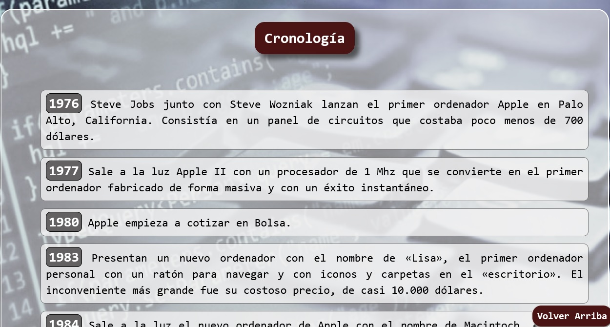
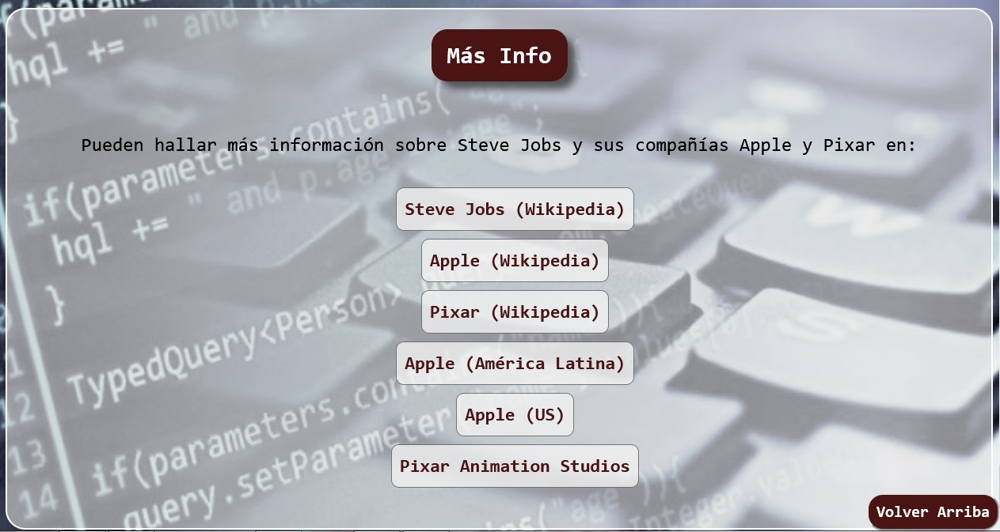

# pagina-tributo
Página tributo a Steve Jobs usando HTML5 y CSS

La misma fue realizada como el primer proyecto propuesto en el curso de diseño web adaptable (Responsive Web Design) 
en [freeCodeCamp](https://www.freecodecamp.org/espanol/learn/responsive-web-design/)

//--------CABECERA--------//

//--------SECCIÓN CRONOLOGÍA--------//

//--------SECCIÓN FRASES CÉLEBRES--------//

//--------SECCIÓN MÁS INFO--------//

